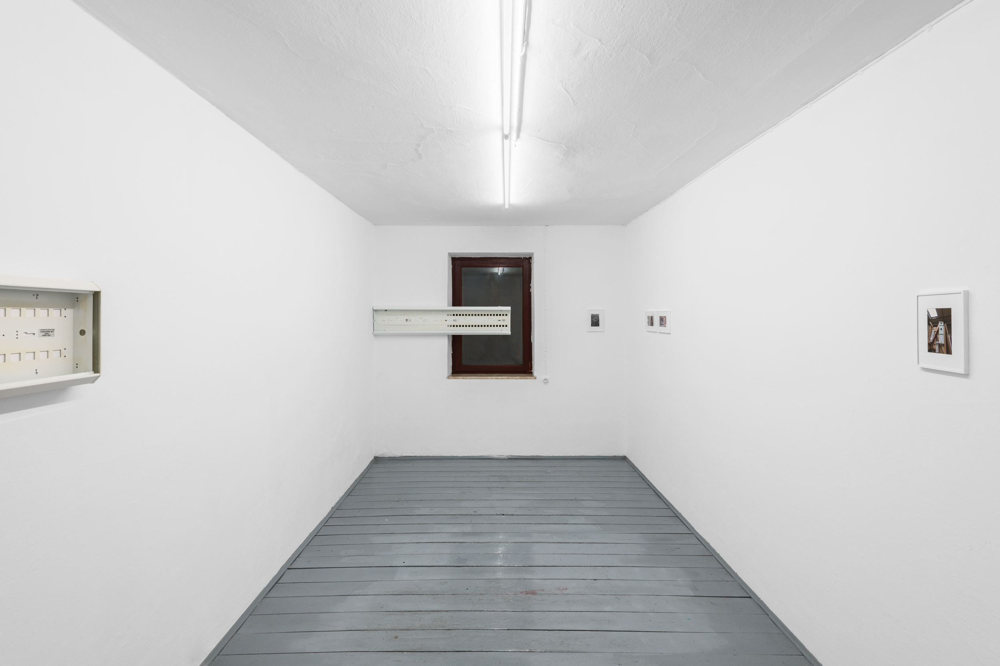
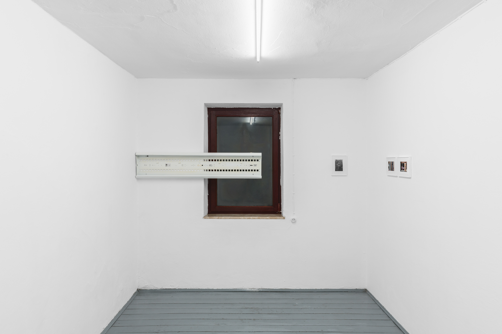

# HTML Website Learning Guide for Art Portfolio

## What is the MINIMUM you need to start an HTML website?

The absolute minimum you need is just **ONE file** with 7 essential lines:

```html
<!DOCTYPE html>
<html>
<head>
    <title>My Website</title>
</head>
<body>
    <h1>Hello World!</h1>
</body>
</html>
```

That's it! Save this as `index.html` and you have a website.

### What each part does:

1. **`<!DOCTYPE html>`** - Tells the browser this is HTML5
2. **`<html>`** - The root element that wraps everything
3. **`<head>`** - Contains information ABOUT your page (not visible on page)
4. **`<title>`** - The text shown in the browser tab
5. **`<body>`** - Contains everything VISIBLE on your page
6. **`<h1>`** - A heading (you can use h1, h2, h3, etc.)

### To view your website:
- Just double-click the `.html` file
- OR right-click and choose "Open with" → your web browser

---

## Building Your Art Portfolio - Step by Step

### Step 1: Add Your Name and Basic Info

```html
<!DOCTYPE html>
<html>
<head>
    <title>Your Name - Artist Portfolio</title>
</head>
<body>
    <h1>Your Name</h1>
    <p>I am an artist based in [Your City].</p>
</body>
</html>
```

### Step 2: Add a List of Your Projects

```html
<h2>My Projects</h2>
<ul>
    <li>The Carrier</li>
    <li>AABB</li>
    <li>First Exposure</li>
</ul>
```

**New tags:**
- `<h2>` = Second-level heading (smaller than h1)
- `<ul>` = Unordered list (bullet points)
- `<li>` = List item

### Step 3: Add Links to Make Items Clickable

```html
<ul>
    <li><a href="carrier.html">The Carrier</a></li>
    <li><a href="aabb.html">AABB</a></li>
    <li><a href="first-exposure.html">First Exposure</a></li>
</ul>
```

**New tag:**
- `<a href="...">` = Link (anchor). The `href` tells it where to go.

### Step 4: Display Your Art Images

```html
<h2>Featured Work</h2>


```

**New tag:**
- `` = Image
  - `src` = source (path to your image file)
  - `alt` = alternative text (describes image if it can't load)

### Step 5: Add CSS to Make It Look Better

You can add styling in three ways:

#### Option A: Inline CSS (inside the tag)
```html
<h1 style="color: blue; text-align: center;">Your Name</h1>
```

#### Option B: Internal CSS (in the head section)
```html
<head>
    <title>Your Portfolio</title>
    <style>
        body {
            font-family: Arial, sans-serif;
            margin: 40px;
        }
        h1 {
            color: #333;
            text-align: center;
        }
        img {
            max-width: 100%;
            height: auto;
        }
    </style>
</head>
```

#### Option C: External CSS (separate file - BEST for larger sites)
Create a file called `style.css`:
```css
body {
    font-family: Arial, sans-serif;
    margin: 40px;
}
h1 {
    color: #333;
}
```

Then link it in your HTML:
```html
<head>
    <title>Your Portfolio</title>
    <link rel="stylesheet" href="style.css">
</head>
```

---

## Common HTML Tags for Art Portfolios

| Tag | What It Does | Example |
|-----|--------------|---------|
| `<h1>` to `<h6>` | Headings (h1 biggest, h6 smallest) | `<h1>Gallery</h1>` |
| `<p>` | Paragraph of text | `<p>This is my art.</p>` |
| `<a>` | Link to another page | `<a href="about.html">About</a>` |
| `` | Display an image | `` |
| `<ul>` and `<li>` | Bullet point list | See Step 2 above |
| `<div>` | Container to group elements | `<div class="gallery">...</div>` |
| `<br>` | Line break | `Line 1<br>Line 2` |
| `<hr>` | Horizontal line | `<hr>` |
| `<em>` | Italic text | `<em>emphasis</em>` |
| `<strong>` | Bold text | `<strong>important</strong>` |

---

## File Structure for Your Portfolio

```
your-portfolio/
├── index.html          (main/home page)
├── style.css           (your styles - optional but recommended)
├── about.html          (about you page - optional)
├── contact.html        (contact page - optional)
└── images/             (folder for all images)
    ├── photo1.jpg
    ├── photo2.jpg
    └── ...
```

---

## Questions to Ask When Learning

Here are specific questions you can ask to learn more:

1. **"How do I center my images?"** - Learn CSS alignment
2. **"How do I create a grid of images?"** - Learn CSS Grid or Flexbox
3. **"How do I make my website look good on phones?"** - Learn responsive design
4. **"How do I add a navigation menu?"** - Learn HTML lists + CSS styling
5. **"How do I create a lightbox for my images?"** - Learn JavaScript basics
6. **"What are meta tags and why do I need them?"** - Learn about SEO
7. **"How do I add a contact form?"** - Learn HTML forms
8. **"How do I change fonts?"** - Learn about web fonts and CSS font-family

---

## What You Already Have

Looking at your current `index.html`, you have:
- ✅ Basic HTML structure
- ✅ Meta tags for SEO
- ✅ A list of projects
- ⚠️  **Issue**: CSS code is mixed in with HTML (lines 24-27)

### Quick Fix Needed:
The CSS in lines 24-27 should be wrapped in `<style>` tags:

```html
<style>
ul {
    list-style-type: none;
}
</style>
```

---

## Next Steps to Improve Your Site

1. Fix the CSS syntax issue
2. Create separate pages for each project (carrier.html, aabb.html, etc.)
3. Add your images to those pages
4. Create a consistent navigation menu
5. Add a simple CSS stylesheet to make it look professional

---

## Resources

- **HTML Reference**: https://developer.mozilla.org/en-US/docs/Web/HTML
- **CSS Reference**: https://developer.mozilla.org/en-US/docs/Web/CSS
- **Free Images Tool**: You can use `` tags to display your art from the `/images` folder

Remember: Start simple, then add one feature at a time. Don't try to learn everything at once!
